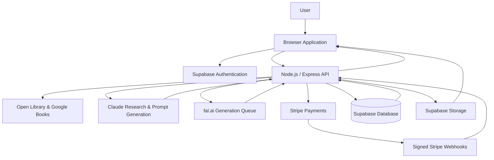
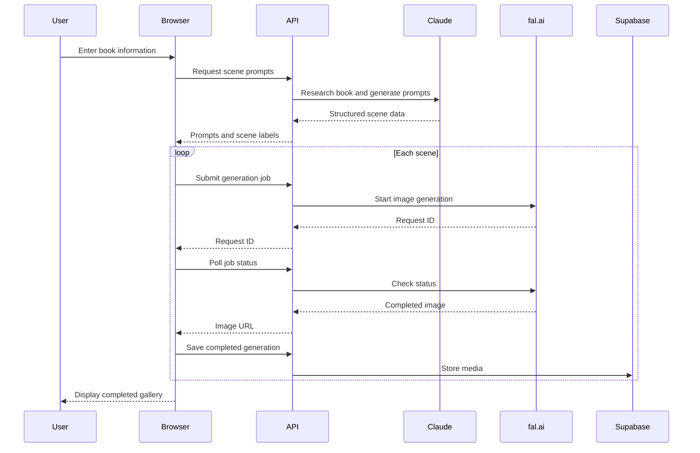

# Lore Studios

Lore Studios is a production AI SaaS platform that transforms books into cinematic, social-ready images and video clips.

Users enter a book title and optional story details. The platform researches the book, identifies notable characters and scenes, creates structured visual prompts, and generates artwork designed for platforms such as BookTok.

🌐 **Live product:** [thislorestudios.com](https://thislorestudios.com)

> This is a sanitized portfolio repository containing representative architecture and selected code. Production credentials, proprietary prompts, customer data, and commercially sensitive logic are excluded.

## Screenshots

### Landing Page


### Book Search and Generator


### Generated Artwork


### Generated Animation Clip


### User Library


### Subscription Plans


### Mobile Experience


## What I Built

I independently designed, developed, and deployed Lore Studios from concept to production.

My work included:

- Product strategy and feature planning
- Responsive frontend design
- Node.js and Express backend development
- AI research and prompt-generation workflows
- Asynchronous image and video generation
- Passwordless user authentication
- Subscription plans and usage limits
- Stripe payments and webhook processing
- Persistent user media libraries
- Book-search and ISBN integrations
- Automated financial reporting
- Production deployment and monitoring

## Core Features

### AI-Powered Book Research

Lore Studios uses an AI workflow with web search to research a book’s characters, visual details, important scenes, emotional themes, and setting.

The system turns that research into structured prompts designed to generate cinematic artwork that reflects the source material.

### Image Generation

The application submits generation jobs asynchronously and polls for their completion.

It supports:

- Multiple concurrent image requests
- Live generation progress
- Partial results as individual jobs finish
- Automatic retries for failed or filtered generations
- Manual regeneration
- Image downloads
- ZIP downloads for complete collections

### Image-to-Video Generation

Users can transform generated images into short cinematic video clips.

The interface manages the longer-running video workflow with:

- Asynchronous job submission
- Status polling
- Progress messaging
- Failure recovery
- Video playback and downloads
- Subscription-based access controls

### Book Search

The search experience combines a curated catalog with external book data.

Local matches appear immediately for frequently requested books. Other queries use the Open Library API, while Google Books helps identify ISBN information.

### Authentication

Supabase magic-link authentication allows users to sign in securely without creating or remembering a password.

Protected API routes verify the user’s access token before allowing generation, library, billing, or account operations.

### Subscription Management

Lore Studios supports multiple subscription tiers with different monthly allowances and feature access.

The system includes:

- Stripe Checkout
- Recurring subscriptions
- Signed webhook processing
- Customer billing portal access
- Plan upgrades and cancellations
- Daily and monthly usage tracking
- Image and video generation limits
- Credit restoration after failed generations

### Personal Media Library

Completed images and videos can be saved to each user’s private library.

Users can:

- View saved generations
- Download images and videos
- Animate previously generated images
- Delete library items
- See book and scene labels
- Access their library across sessions

Stored media is validated on the server before being copied into managed storage. Library size is automatically limited according to the user’s subscription.

### Author Launch Packages

Independent authors can purchase customized creative packages through a separate one-time checkout workflow.

This experience includes:

- Dynamic package pricing
- Optional add-ons
- Stripe Checkout
- Payment verification
- Post-purchase questionnaire
- Order storage
- Automated order notifications

### Automated Financial Reporting

I also built an internal financial automation agent for the platform.

It:

- Reads revenue and subscription data from Stripe
- Calculates monthly recurring revenue
- Tracks payment volume and processing fees
- Records estimated AI and infrastructure expenses
- Calculates monthly profit or loss
- Appends results to Google Sheets
- Sends weekly and monthly email summaries automatically

Financial data and implementation details are intentionally excluded from this public repository.

## Technology

- **Frontend:** HTML, CSS, and JavaScript
- **Backend:** Node.js and Express
- **Database:** Supabase PostgreSQL
- **Authentication:** Supabase Auth
- **Media storage:** Supabase Storage
- **AI orchestration:** Anthropic Claude
- **AI research:** Claude web search
- **Image generation:** fal.ai and FLUX
- **Video generation:** fal.ai and Kling
- **Book data:** Open Library and Google Books APIs
- **Payments:** Stripe Checkout, subscriptions, webhooks, and billing portal
- **Email:** Resend
- **Financial reporting:** Stripe API and Google Sheets API
- **Hosting:** Railway
- **DNS and domain infrastructure:** Cloudflare
- **Version control:** Git and GitHub

## System Architecture



## Generation Workflow



## Frontend Engineering

The frontend coordinates several asynchronous workflows while keeping the interface responsive.

Notable implementations include:

- Concurrent generation using `Promise.allSettled`
- Staggered API requests
- Generation-status polling
- Automatic and manual retries
- Partial rendering as results finish
- Loading, success, and error states
- Subscription-aware controls
- Responsive image galleries
- Client-side ZIP creation
- Image and video downloads
- Debounced autocomplete
- Authentication-state handling
- Persistent user-library management

## Backend Engineering

The Express backend is responsible for:

- Authenticating protected requests
- Validating user input
- Researching book information
- Generating structured AI prompts
- Submitting asynchronous image and video jobs
- Enforcing plan limits
- Recording usage
- Refunding failed-generation credits
- Validating media sources
- Storing generated assets
- Managing user libraries
- Creating Stripe checkout sessions
- Verifying Stripe webhook signatures
- Processing subscription changes
- Verifying one-time payments
- Recording author-package orders
- Sending transactional notifications
- Automating financial reports

## Engineering Decisions

### Asynchronous Generation

Image and video generation can take significantly longer than a standard HTTP request. Instead of keeping a single request open, the backend submits each job to a queue and immediately returns a request ID.

The frontend polls a status endpoint until the generation succeeds or fails. This makes the workflow more resilient to hosting timeouts and allows progress to be shown to the user.

### Concurrent Results

Image jobs run concurrently rather than sequentially. As each image completes, it is added to the gallery immediately.

Using `Promise.allSettled` means one failed generation does not discard the successful results from the other jobs.

### Failure Recovery

AI generation services can reject, filter, or fail individual jobs. Lore Studios handles these conditions through:

- Automatic retries
- Manual retry controls
- Clear failure states
- Usage-credit refunds when the user receives no result
- Partial success handling

### Server-Side Credential Protection

Private API keys, Stripe secrets, privileged database credentials, and proprietary AI instructions remain on the server.

The browser receives only information required for the user-facing experience.

### Hybrid Book Search

Popular titles are matched locally for an immediate autocomplete experience. Less common searches fall back to an external book API.

This reduces unnecessary network calls while preserving broad search coverage.

### Usage Enforcement

Plan limits are enforced on the server rather than relying on frontend controls. Usage counters automatically account for daily and monthly reset periods.

This prevents users from bypassing plan restrictions through browser manipulation.

### Payment Verification

Stripe webhook signatures are verified before subscription or order information is changed.

The author questionnaire also verifies that its associated checkout session was successfully paid before saving the order.

### User-Owned Media

Library operations are scoped to the authenticated user. Asset URLs are validated before the backend downloads and stores generated media.

This reduces the risk of unauthorized deletion or arbitrary remote-file ingestion.

## Selected Code

This repository contains sanitized examples of:

- Authentication middleware
- Usage-limit calculations
- Asynchronous generation and polling
- Concurrent frontend job management
- Book autocomplete
- Loading and error-state handling
- Stripe webhook processing
- User-library operations
- Media-source validation
- Storage-cap management

The complete production source is private.

## Repository Structure

```text
lore-studios-showcase/
├── README.md
├── .gitignore
├── .env.example
├── screenshots/
│   ├── homepage.png
│   ├── generator.png
│   ├── results.png
│   ├── library.png
│   ├── pricing.png
│   └── mobile.png
└── src/
    ├── frontend/
    │   ├── generation-workflow.js
    │   ├── book-autocomplete.js
    │   └── library-ui.js
    └── backend/
        ├── auth-middleware.js
        ├── generation-queue.js
        ├── usage-limits.js
        └── stripe-webhook.js
```

## Environment Variables

Production credentials are not included. A local implementation would use environment variables resembling:

```env
APP_URL=http://localhost:3000

ANTHROPIC_API_KEY=your_anthropic_key
FAL_API_KEY=your_fal_key

SUPABASE_URL=your_supabase_url
SUPABASE_ANON_KEY=your_public_anon_key
SUPABASE_SERVICE_ROLE_KEY=your_private_service_key

STRIPE_SECRET_KEY=your_stripe_secret
STRIPE_WEBHOOK_SECRET=your_webhook_secret
STRIPE_STARTER_PRICE_ID=your_price_id
STRIPE_CREATOR_PRICE_ID=your_price_id
STRIPE_PRO_PRICE_ID=your_price_id
STRIPE_PLATINUM_PRICE_ID=your_price_id

GOOGLE_BOOKS_API_KEY=your_google_books_key
RESEND_API_KEY=your_resend_key
```

Real `.env` files must never be committed to source control.

## My Role

I independently handled the product from concept through production, including:

- Identifying the product opportunity
- Defining the business model
- Designing the user experience
- Building the frontend and backend
- Integrating AI services
- Implementing authentication and storage
- Building payment and subscription workflows
- Testing and debugging asynchronous processes
- Deploying the application
- Monitoring costs and financial performance
- Iterating on the product after launch

## What This Project Demonstrates

- End-to-end product ownership
- Full-stack web development
- Applied AI engineering
- Asynchronous job orchestration
- API integration
- Authentication and authorization
- Database and object-storage integration
- Subscription and payment infrastructure
- Error handling and resilient workflows
- Responsive product design
- Production deployment
- Business-process automation

## Privacy and Source Availability

This repository is a portfolio showcase, not the complete commercial source code.

The following are intentionally excluded:

- Production credentials
- Complete proprietary AI prompts
- Customer and financial data
- Internal cost assumptions
- Private database details
- Complete payment implementation
- Commercially sensitive business logic

## Project Status

Lore Studios is live and actively developed.

Visit the product at [thislorestudios.com](https://thislorestudios.com).

## Disclaimer

Lore Studios is an independent creative tool and is not affiliated with, endorsed by, or sponsored by any author, publisher, or rights holder.

Generated artwork is fan-made and subject to the terms presented within the live product.

## Contact

- **Email:** kristen@thislorestudios.com
- **LinkedIn:** https://www.linkedin.com/in/kristen-maddox-8b8b8b84/
- **GitHub:** https://github.com/kristenthepages
